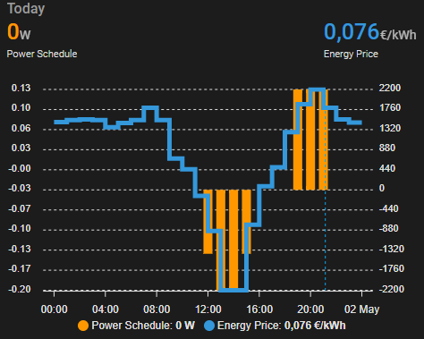

# ha-sessy-examples
Example automations for using Sessy with Home Assistant

## Sessy X-on the meter (XOM) automation
Controls Sessy to maintain value X on the grid meter.
- Load balancing across multiple Sessy's
- Except certain load via offset entities (e.g. EV charger)

## Sessy Full charge script
Charges Sessy to the specified amount, then activates a certain strategy.
- Supports multiple Sessy's
- Script ends when all Sessy's report full, above set percentage, or after timeout passes.

## Sessy Dynamic Schedule with ApexCharts
Display the power schedule and energy prices for the dynamic strategy within Home Assistant using ApexCharts. 

[Learn More](cards/DynamicSchedule.md)