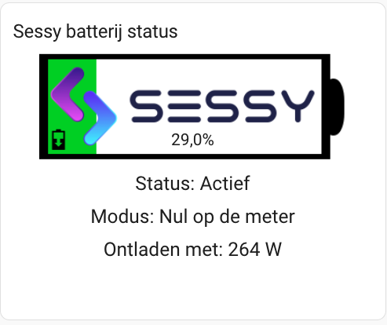

# Sessy Battery Status view

## Requirements
- Sessy batterij (duh)
- [Sessy Integratie](https://github.com/PimDoos/ha-sessy)
- [Apexcharts LoveLace](https://github.com/RomRider/apexcharts-card)
- Home Assistant version 2022.7 or newer.

## Installation

1. Kopieer alle afbeeldingen "cards/images naar je Home assistant systeem "/local/images/sessy".
2. Creeer nieuwe LoveLave views zoals hieronder getoond.
3. Vervang de sessy entities met jouw entitities in de lovelace yaml views


```
elements:
  - entity: sensor.sessy_xxxx_state_of_charge
    image: /local/images/sessy/sessy-0.png
    state_image:
      '0': /local/images/sessy/sessy-0.png
      '100': /local/images/sessy/sessy-100.png
      '1.0': /local/images/sessy/sessy-0.png
      '2.0': /local/images/sessy/sessy-0.png
      '3.0': /local/images/sessy/sessy-0.png
      '4.0': /local/images/sessy/sessy-0.png
      '5.0': /local/images/sessy/sessy-0.png
      '6.0': /local/images/sessy/sessy-0.png
      '7.0': /local/images/sessy/sessy-0.png
      '8.0': /local/images/sessy/sessy-0.png
      '9.0': /local/images/sessy/sessy-0.png
      '10.0': /local/images/sessy/sessy-10.png
      '11.0': /local/images/sessy/sessy-10.png
      '12.0': /local/images/sessy/sessy-10.png
      '13.0': /local/images/sessy/sessy-10.png
      '14.0': /local/images/sessy/sessy-10.png
      '15.0': /local/images/sessy/sessy-10.png
      '16.0': /local/images/sessy/sessy-10.png
      '17.0': /local/images/sessy/sessy-10.png
      '18.0': /local/images/sessy/sessy-10.png
      '19.0': /local/images/sessy/sessy-10.png
      '20.0': /local/images/sessy/sessy-20.png
      '21.0': /local/images/sessy/sessy-20.png
      '22.0': /local/images/sessy/sessy-20.png
      '23.0': /local/images/sessy/sessy-20.png
      '24.0': /local/images/sessy/sessy-20.png
      '25.0': /local/images/sessy/sessy-20.png
      '26.0': /local/images/sessy/sessy-20.png
      '27.0': /local/images/sessy/sessy-20.png
      '28.0': /local/images/sessy/sessy-20.png
      '29.0': /local/images/sessy/sessy-20.png
      '30.0': /local/images/sessy/sessy-30.png
      '31.0': /local/images/sessy/sessy-30.png
      '32.0': /local/images/sessy/sessy-30.png
      '33.0': /local/images/sessy/sessy-30.png
      '34.0': /local/images/sessy/sessy-30.png
      '35.0': /local/images/sessy/sessy-30.png
      '36.0': /local/images/sessy/sessy-30.png
      '37.0': /local/images/sessy/sessy-30.png
      '38.0': /local/images/sessy/sessy-30.png
      '39.0': /local/images/sessy/sessy-30.png
      '40.0': /local/images/sessy/sessy-40.png
      '41.0': /local/images/sessy/sessy-40.png
      '42.0': /local/images/sessy/sessy-40.png
      '43.0': /local/images/sessy/sessy-40.png
      '44.0': /local/images/sessy/sessy-40.png
      '45.0': /local/images/sessy/sessy-40.png
      '46.0': /local/images/sessy/sessy-40.png
      '47.0': /local/images/sessy/sessy-40.png
      '48.0': /local/images/sessy/sessy-40.png
      '49.0': /local/images/sessy/sessy-40.png
      '50.0': /local/images/sessy/sessy-50.png
      '51.0': /local/images/sessy/sessy-50.png
      '52.0': /local/images/sessy/sessy-50.png
      '53.0': /local/images/sessy/sessy-50.png
      '54.0': /local/images/sessy/sessy-50.png
      '55.0': /local/images/sessy/sessy-50.png
      '56.0': /local/images/sessy/sessy-50.png
      '57.0': /local/images/sessy/sessy-50.png
      '58.0': /local/images/sessy/sessy-50.png
      '59.0': /local/images/sessy/sessy-50.png
      '60.0': /local/images/sessy/sessy-60.png
      '61.0': /local/images/sessy/sessy-60.png
      '62.0': /local/images/sessy/sessy-60.png
      '63.0': /local/images/sessy/sessy-60.png
      '64.0': /local/images/sessy/sessy-60.png
      '65.0': /local/images/sessy/sessy-60.png
      '66.0': /local/images/sessy/sessy-60.png
      '67.0': /local/images/sessy/sessy-60.png
      '68.0': /local/images/sessy/sessy-60.png
      '69.0': /local/images/sessy/sessy-60.png
      '70.0': /local/images/sessy/sessy-70.png
      '71.0': /local/images/sessy/sessy-70.png
      '72.0': /local/images/sessy/sessy-70.png
      '73.0': /local/images/sessy/sessy-70.png
      '74.0': /local/images/sessy/sessy-70.png
      '75.0': /local/images/sessy/sessy-70.png
      '76.0': /local/images/sessy/sessy-70.png
      '77.0': /local/images/sessy/sessy-70.png
      '78.0': /local/images/sessy/sessy-70.png
      '79.0': /local/images/sessy/sessy-70.png
      '80.0': /local/images/sessy/sessy-80.png
      '81.0': /local/images/sessy/sessy-80.png
      '82.0': /local/images/sessy/sessy-80.png
      '83.0': /local/images/sessy/sessy-80.png
      '84.0': /local/images/sessy/sessy-80.png
      '85.0': /local/images/sessy/sessy-80.png
      '86.0': /local/images/sessy/sessy-80.png
      '87.0': /local/images/sessy/sessy-80.png
      '88.0': /local/images/sessy/sessy-80.png
      '89.0': /local/images/sessy/sessy-80.png
      '90.0': /local/images/sessy/sessy-90.png
      '91.0': /local/images/sessy/sessy-90.png
      '92.0': /local/images/sessy/sessy-90.png
      '93.0': /local/images/sessy/sessy-90.png
      '94.0': /local/images/sessy/sessy-90.png
      '95.0': /local/images/sessy/sessy-90.png
      '96.0': /local/images/sessy/sessy-90.png
      '97.0': /local/images/sessy/sessy-90.png
      '98.0': /local/images/sessy/sessy-90.png
      '99.0': /local/images/sessy/sessy-90.png
    style:
      left: 50%
      top: 17%
      width: 80%
    type: image
  - entity: sensor.sessy_xxxx_state_of_charge
    style:
      left: 50%
      top: 30%
      font-size: 150%
    type: state-label
  - entity: sensor.sessy_xxxx_system_state
    style:
      left: 50%
      top: 47%
      font-size: 175%
      text-align: center
    type: state-label
    prefix: 'Status: '
  - entity: select.sessy_xxxx_power_strategy
    style:
      left: 50%
      top: 60%
      font-size: 175%
      text-align: center
    type: state-label
    prefix: 'Modus: '
  - type: conditional
    conditions:
      - entity: sensor.sessy_xxxx_charge_power
        state_not: '0'
    elements:
      - type: state-label
        prefix: 'Opladen met: '
        entity: sensor.sessy_xxxx_charge_power
        style:
          top: 73%
          left: 50%
          font-size: 175%
          text-align: center
  - type: conditional
    conditions:
      - entity: sensor.sessy_xxxx_discharge_power
        state_not: '0'
    elements:
      - type: state-label
        prefix: 'Ontladen met: '
        entity: sensor.sessy_xxxx_discharge_power
        style:
          top: 73%
          left: 50%
          font-size: 175%
          text-align: center
  - type: conditional
    conditions:
      - entity: sensor.sessy_xxxx_charge_power
        state_not: '0'
    elements:
      - type: image
        entity: sensor.sessy_xxxx_charge_power
        image: /local/images/sessy/sessy-charging.png
        style:
          top: 30%
          left: 15%
  - type: conditional
    conditions:
      - entity: sensor.sessy_xxxx_discharge_power
        state_not: '0'
    elements:
      - type: image
        entity: sensor.sessy_xxxx_discharge_power
        image: /local/images/sessy/sessy-discharging.png
        style:
          top: 30%
          left: 15%
title: Sessy batterij status
image: /local/images/sessy/blank.png
type: picture-elements
```

