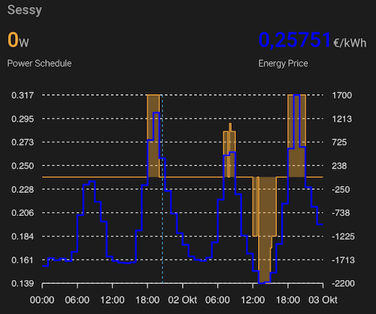

# Sessy Dynamic Schedule with ApexCharts
Since ha-sessy 0.6.0 and Sessy firmware 1.6.5, Sessy's dynamic schedule and energy prices are visible within Home Assistant.

With the [ApexCharts custom card](https://github.com/RomRider/apexcharts-card?tab=readme-ov-file#installation) you can show this data in a graph.



# Card configuration
**Note**: Replace 'sessy_XXXX' in the examples below with the name of your own Sessy.

## DynamicSchedule V3

Applicable to Sessy with firmware 1.10.0 or higher and HA-Sessy 1.0.3 or higher. Shows all dynamic schedule and price data in one graph, now in 15 min steps, to account for quarterly prices and schedule steps.

```yaml
type: custom:apexcharts-card
header:
  show: true
  title: Sessy
  show_states: true
  colorize_states: true
now:
  show: true
graph_span: 2d
span:
  start: day
color_list:
  - orange
  - blue
apex_config:
  legend:
    show: false
yaxis:
  - id: power
    decimals: 0
    opposite: true
  - id: price
    decimals: 3
series:
  - entity: sensor.sessy_1_power_schedule
    yaxis_id: power
    name: Power Schedule
    show:
      in_header: raw
    type: area
    curve: stepline
    opacity: 0.4
    stroke_width: 1
    data_generator: |
      const STEP = 15 * 60 * 1000;
      const changes = Object.entries(entity.attributes.dynamic_schedule || {})
        .map(([k, v]) => [new Date(k).getTime(), Number(v)])
        .sort((a, b) => a[0] - b[0]);
      if (!changes.length) return [];

      const from = new Date(start).getTime();
      const to = new Date(end).getTime();

      const data = [];
      let j = 0, value = 0;
      for (let ts = from; ts < to; ts += STEP) {
        while (j < changes.length && changes[j][0] <= ts) value = changes[j++][1];
        data.push([ts, value]);
      }
      return data;
  - entity: sensor.sessy_1_energy_price
    yaxis_id: price
    name: Energy Price
    type: line
    curve: stepline
    stroke_width: 2
    show:
      in_header: raw
    float_precision: 5
    data_generator: |
      const STEP = 15 * 60 * 1000;
      const prices = Object.entries(entity.attributes.energy_prices || {})
        .map(([k, v]) => [new Date(k).getTime(), Number(v)])
        .sort((a, b) => a[0] - b[0]);
      if (!prices.length) return [];

      const from = new Date(start).getTime();
      const to = new Date(end).getTime();

      const data = [];
      let j = 0, value = null;
      for (let ts = from; ts < to; ts += STEP) {
        while (j < prices.length && prices[j][0] <= ts) value = prices[j++][1];
        data.push([ts, value]);
      }
      return data;
```

## DynamicSchedule V2

Applicable to Sessy with firmware 1.10.0 or higher and HA-Sessy 0.9.0 or higher. Shows all dynamic schedule data in one graph.

```yaml
type: custom:apexcharts-card
header:
  show: true
  title: Today
  show_states: true
  colorize_states: true
now:
  show: true
graph_span: 2d
span:
  start: day
yaxis:
  - id: power
    decimals: 0
    opposite: true
  - id: price
    decimals: 2
series:
  - entity: sensor.sessy_XXXX_power_schedule
    yaxis_id: power
    name: Power Schedule
    type: column
    show:
      in_header: raw
    data_generator: |
      var data = [];
      for (let i in entity.attributes.dynamic_schedule){
        data.push([i, entity.attributes.dynamic_schedule[i]]);
      }
      return data;

  - entity: sensor.sessy_XXXX_energy_price
    yaxis_id: price
    name: Energy Price
    curve: stepline
    show:
      in_header: raw
    float_precision: 5
    data_generator: |
      var data = [];
      for (let i in entity.attributes.energy_prices){
        data.push([i, entity.attributes.energy_prices[i]]);
      }
      return data;

```


## Dynamic Schedule v1
For HA-Sessy 0.8.6 and older, Sessy firmware 1.9.1 and older.

### Today

```yaml
type: custom:apexcharts-card
header:
  show: true
  title: Today
  show_states: true
  colorize_states: true
now:
  show: true
span:
  start: day
yaxis:
  - id: power
    decimals: 0
    opposite: true
  - id: price
    decimals: 2
series:
  - entity: sensor.sessy_XXXX_power_schedule
    yaxis_id: power
    name: Power Schedule
    type: column
    show:
      in_header: raw
    data_generator: |
      let hours = [];
      for(var i = 0; i < 24; i++){ hours.push(i); }
      let date = new Date().getTime();
      let dateindex = new Date(date).toISOString().split("T")[0];
      return hours.map((hour, index) => {
        let date = new Date(dateindex).setHours(hour,0,0);
        return [date, entity.attributes[dateindex][index]];
      });
  - entity: sensor.sessy_XXXX_energy_price
    yaxis_id: price
    name: Energy Price
    curve: stepline
    show:
      in_header: raw
    float_precision: 5
    data_generator: |
      let hours = [];
      for(var i = 0; i < 24; i++){ hours.push(i); }
      let date = new Date().getTime();
      let dateindex = new Date(date).toISOString().split("T")[0];
      return hours.map((hour, index) => {
        let date = new Date(dateindex).setHours(hour,0,0);
        return [date, entity.attributes[dateindex][index]];
      });
```

### Tomorrow
```yaml
type: custom:apexcharts-card
header:
  show: true
  title: Tomorrow
  show_states: false
span:
  start: day
  offset: +1d
yaxis:
  - id: power
    decimals: 0
    opposite: true
  - id: price
    decimals: 2
series:
  - entity: sensor.sessy_XXXX_power_schedule
    yaxis_id: power
    name: Power Schedule
    type: column
    data_generator: |
      let hours = [];
      for(var i = 0; i < 24; i++){ hours.push(i); }
      let date = new Date().getTime() + 86400000;
      let dateindex = new Date(date).toISOString().split("T")[0];
      return hours.map((hour, index) => {
        let date = new Date(dateindex).setHours(hour,0,0);
        return [date, entity.attributes[dateindex][index]];
      });
  - entity: sensor.sessy_XXXX_energy_price
    yaxis_id: price
    name: Energy Price
    curve: stepline
    float_precision: 5
    data_generator: |
      let hours = [];
      for(var i = 0; i < 24; i++){ hours.push(i); }
      let date = new Date().getTime() + 86400000;
      let dateindex = new Date(date).toISOString().split("T")[0];
      return hours.map((hour, index) => {
        let date = new Date(dateindex).setHours(hour,0,0);
        return [date, entity.attributes[dateindex][index]];
      });
```
