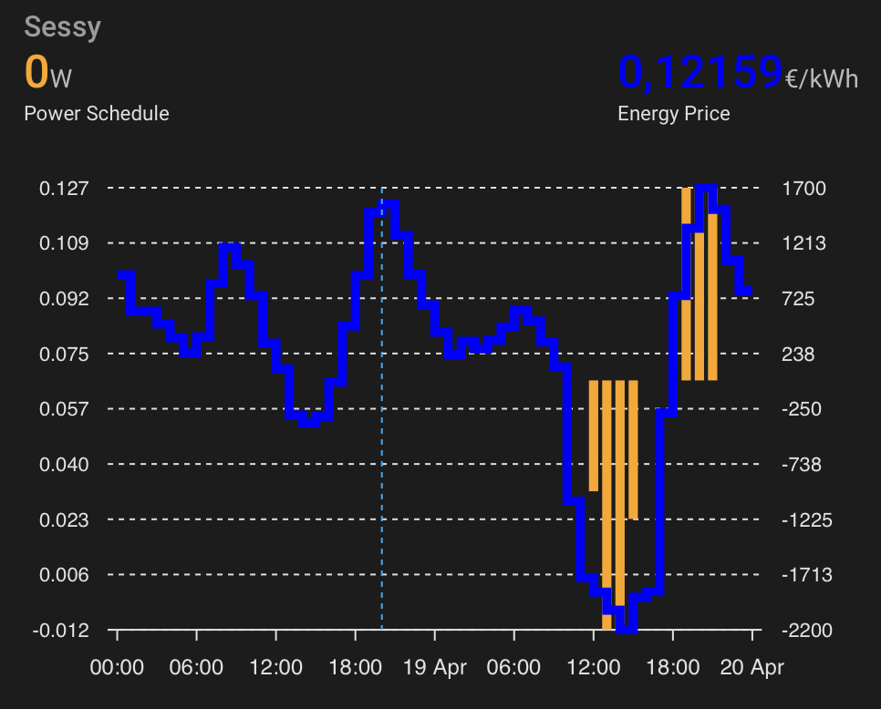

# Sessy Dynamic Schedule with ApexCharts
## Today and tomorrow combined

Since ha-sessy 0.6.0 and Sessy firmware 1.6.5, Sessy's dynamic schedule and energy prices are visible within Home Assistant.



# Card configuration
**Note**: Replace 'sessy_XXXX' in the examples below with the name of your own Sessy.

## Today and tomorrow
```yaml
type: custom:apexcharts-card
header:
  show: true
  title: Sessy schedule
  show_states: true
  colorize_states: true
now:
  show: true
graph_span: 2d
span:
  start: day
color_list:
  - orange
  - blue
apex_config:
  legend:
    show: false
yaxis:
  - id: power
    decimals: 0
    opposite: true
  - id: price
    decimals: 3
series:
  - entity: sensor.sessy_XXXX_power_schedule
    yaxis_id: power
    name: Power Schedule
    show:
      in_header: before_now
    type: column
    curve: stepline
    data_generator: |
      let today = moment().startOf('day');
      let points = [];
      for(var i = 0; i < 48; i++){
        let date = moment(today).add(i, 'hours')
        let value = null;
        if(entity.attributes.hasOwnProperty(date.format("YYYY-MM-DD")))
        {
          value = entity.attributes[date.format("YYYY-MM-DD")][date.hours()]
        }
        points.push([date, value])
      }
      return points;
  - entity: sensor.sessy_XXXX_energy_price
    yaxis_id: price
    name: Energy Price
    curve: stepline
    show:
      in_header: before_now
    float_precision: 5
    data_generator: |
      let today = moment().startOf('day');
      let points = [];
      for(var i = 0; i < 48; i++){
        let date = moment(today).add(i, 'hours')
        let value = null;
        if(entity.attributes.hasOwnProperty(date.format("YYYY-MM-DD")))
        {
          value = entity.attributes[date.format("YYYY-MM-DD")][date.hours()]
        }
        points.push([date, value])
      }
      return points;

```
